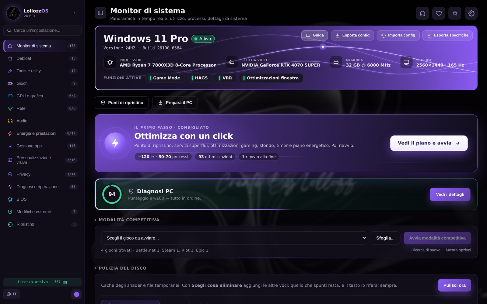
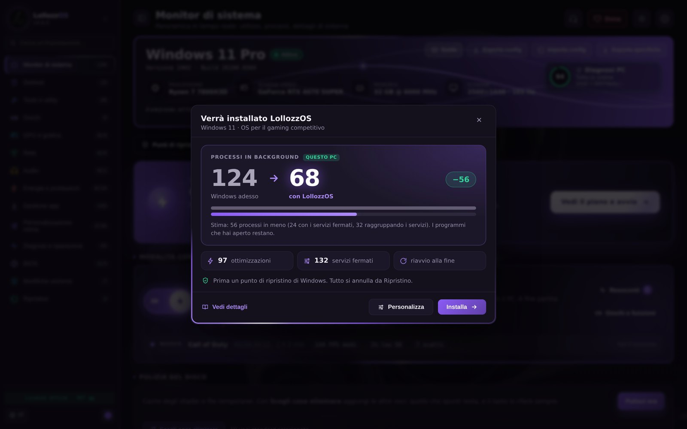
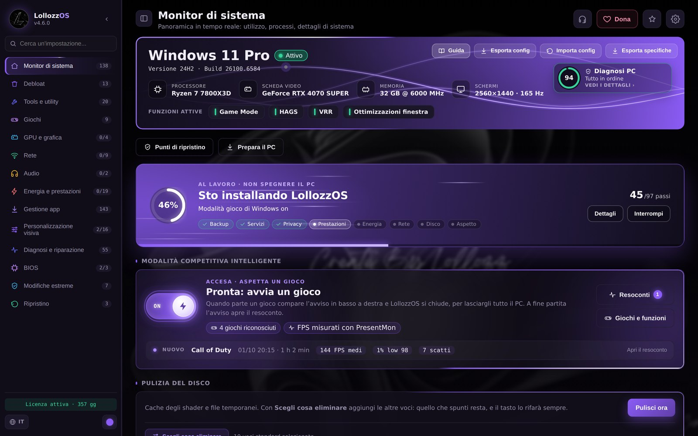
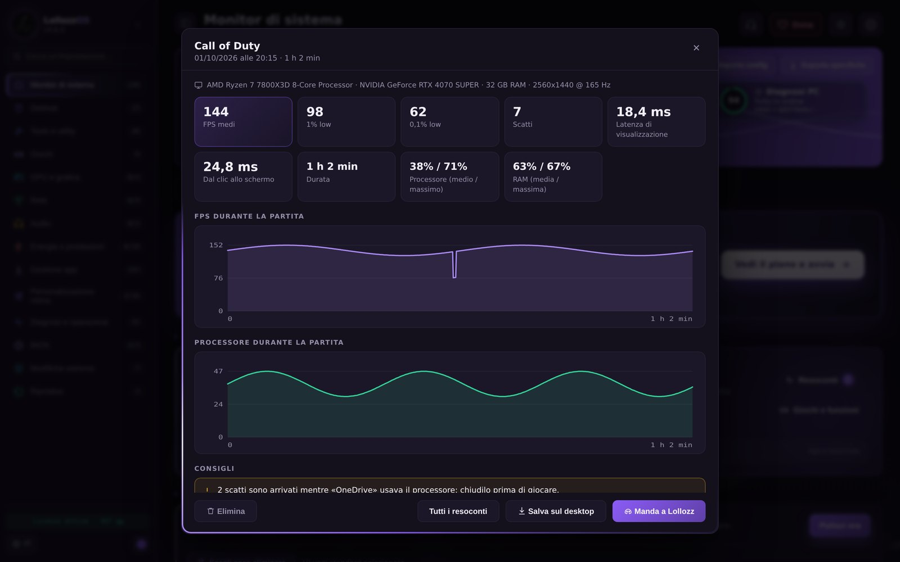
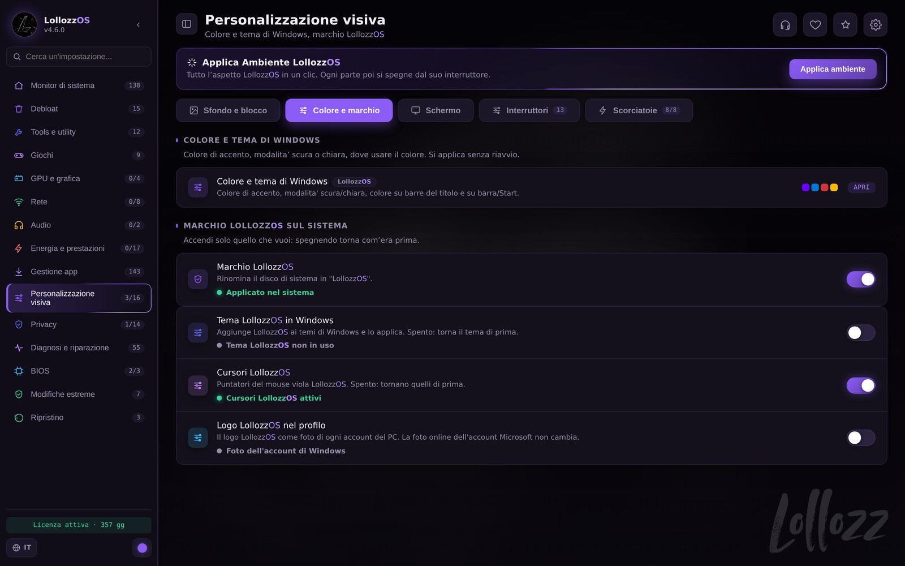
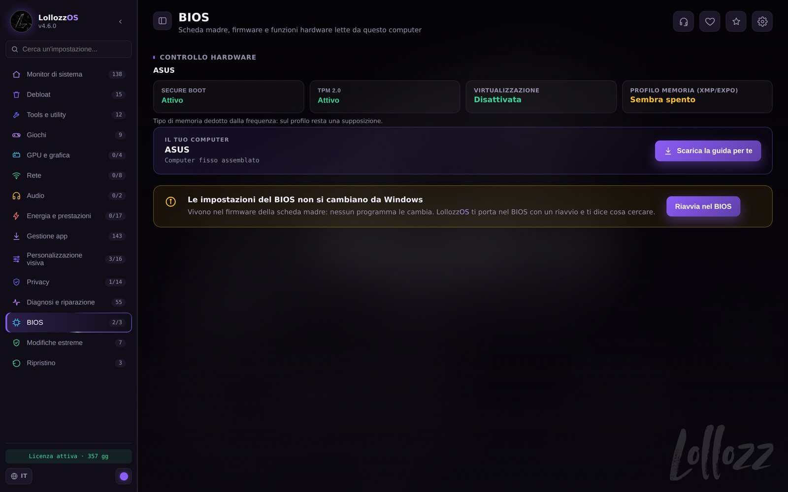
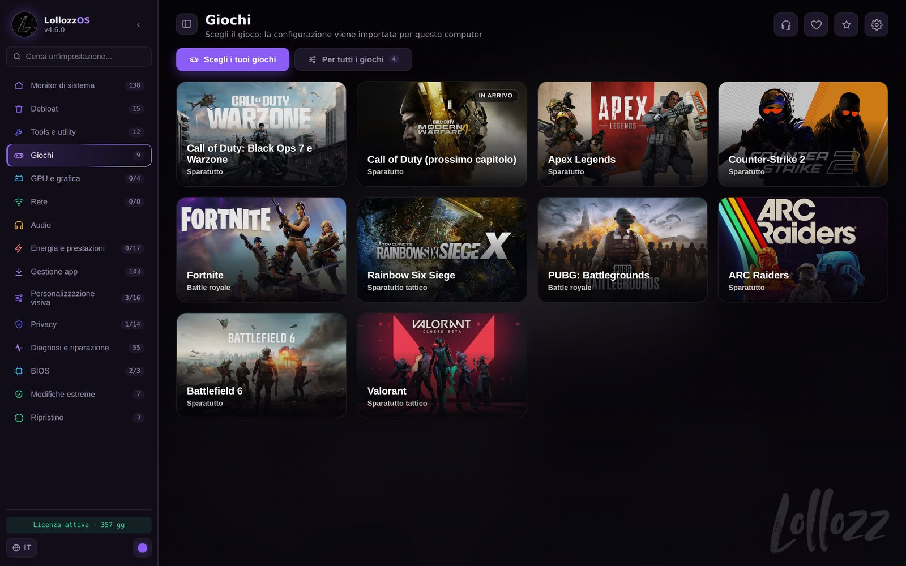
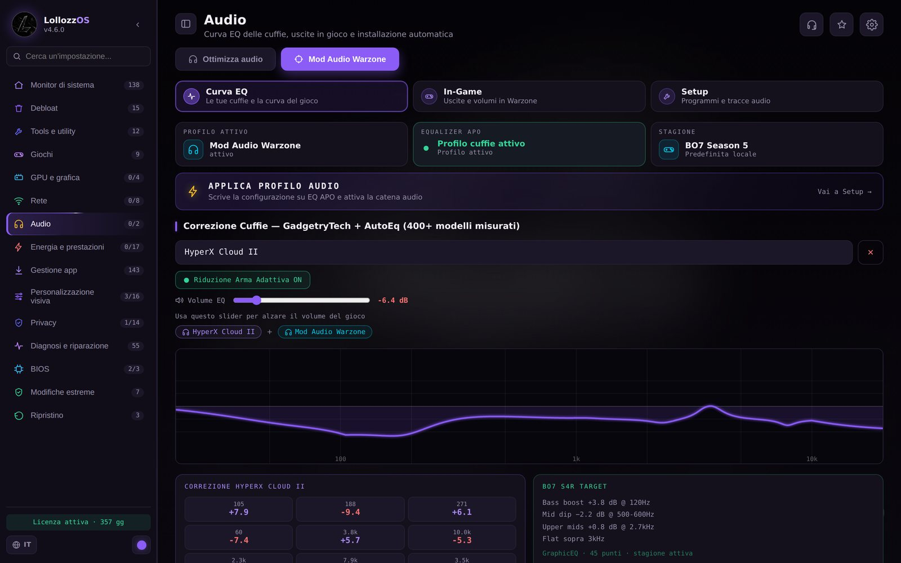

  

<h1 align="center">LollozzOS</h1>

  <b>Il tuo PC, pronto per giocare.</b> 
  Ottimizzazione di Windows 10 e 11 per il gaming, in un’app sola. Ogni modifica si annulla.

  <a href="https://lollozzos.github.io/LollozzOs_Configurator/"><b>Sito</b></a> ·
  <a href="#novita"><b>Novità</b></a> ·
  <a href="https://github.com/LollozzOS/LollozzOs_Configurator/releases/latest"><b>Scarica</b></a> ·
  <a href="https://discord.gg/gd5cT3Jw9M"><b>Discord</b></a> ·
  <a href="#english">English</a>

  

---

## Novità

*Aggiornato al 2 ottobre 2026.* L’app controlla da sola gli aggiornamenti: quando esce una versione nuova te lo dice, la scarica e apre l’installazione (licenza, impostazioni e backup restano).

- **Modalità competitiva intelligente** *(nuovo)*: la accendi una volta e fa
  tutto da sola. Parte quando avvii un gioco e si spegne quando lo chiudi,
  anche con LollozzOS chiusa. Il gioco a priorità alta, tutte le altre app in
  risparmio, timer a 0,5 ms.
- **Il resoconto di ogni partita** *(nuovo)*: FPS medi, 1% e 0,1% low, gli
  scatti con quello che in quel momento usava il processore, la latenza e i
  consigli. Gli ultimi 30 restano nell’app: li salvi sul desktop o li mandi a
  Lollozz.
- **Ottimizza con un click, più chiaro** *(nuovo)*: prima vedi i processi di adesso, contati sul tuo PC, e la stima di quelli con LollozzOS, e “Vedi dettagli” con
  tutto quello che cambia. L’avanzamento sta nella Home; alla fine il PC si
  riavvia da solo e LollozzOS ti mostra il risultato.
- **Windows nel colore che vuoi** *(nuovo)*: accento, modalità scura o chiara,
  riquadro di selezione e 17 cursori in qualsiasi colore, con l’anteprima di
  Esplora file e i cursori veri. Con “Un colore per tutto” si colora anche
  l’app.
- **Mod Audio a un pulsante**: “Applica Mod Audio Warzone” installa e configura
  tutto e ti chiede solo le cuffie. Poi la catena resta sotto controllo, dal
  gioco alle cuffie, e “Ripara” rimette quello che un aggiornamento ha rotto.
- **Il BIOS più recente**: LollozzOS controlla sul sito del produttore se per la
  tua scheda madre c’è un BIOS più recente, lo scarica e lo verifica.
  L’aggiornamento lo fai tu, dal BIOS.
- **Il menu del tasto destro**: Strumenti rapidi, Piani energetici, Mod Audio e
  Pad nel menu del tasto destro del desktop: l’overclock del pad, che LollozzOS
  copia sul PC, e il sito per calibrarlo.
- **Più sicuro**: i punti di ripristino di Windows li crei e li usi dall’app,
  il Ripristino annulla tutto o una modifica alla volta, e se Windows ha un
  aggiornamento a metà LollozzOS aspetta prima di cambiare qualcosa.

## Cos’è

LollozzOS mette in un’app sola quello che di solito è sparso fra decine di
script, guide e programmi: meno processi in background, rete e scheda video
impostate per il gioco, configurazioni pronte per i tuoi giochi. Prima di ogni
modifica l’app salva com’era, quindi tutto si può annullare.

- **Sistema:** Windows 10 e Windows 11, 64 bit
- **Avvio:** come amministratore (cambia impostazioni di sistema)
- **Lingua dell’app:** italiano e inglese (segue la lingua di Windows; si cambia dal globo in basso a sinistra)
- **Prova gratuita:** 24 ore, una volta per computer

## Ottimizza con un click

Il primo passo consigliato: punto di ripristino, servizi superflui, privacy,
ottimizzazioni per il gaming, energia, rete e l’aspetto LollozzOS, poi un
riavvio.

- Prima di partire vedi i processi di adesso, contati sul tuo PC, e la stima di quelli con LollozzOS. “Vedi dettagli” mostra tutto quello che cambia, gruppo per
  gruppo.
- Qualche domanda (Wi-Fi, Bluetooth, stampa, Store, Xbox, colori…) decide cosa
  resta, con la risposta consigliata già segnata; con “Personalizza” accendi e
  spegni le voci una per una.
- La copia delle impostazioni attuali c’è sempre, ed è quella che permette di
  annullare tutto. Il punto di ripristino di Windows parte già segnato.
- L’avanzamento lo vedi nel riquadro della Home: la percentuale, il passo in
  corso e le fasi.
- Alla fine il PC si riavvia da solo dopo 20 secondi: salva prima il lavoro
  aperto. Dopo il riavvio LollozzOS si riapre e ti mostra processi, servizi e
  avvio di Windows prima e dopo.

## Modalità competitiva intelligente

La accendi una volta e non devi fare altro. Quando parte un gioco gli dà la
precedenza, quando lo chiudi rimette tutto com’era. Funziona anche con
LollozzOS chiusa, dopo il riavvio e con qualunque launcher.

- Gioco a priorità alta su tutti i core, scheda video più potente, Modalità
  gioco e timer di Windows a 0,5 ms.
- Tutte le altre app in risparmio: Discord, OBS e i programmi delle periferiche restano aperti e funzionano, ma lasciano il processore al gioco (se registri o trasmetti in x264, OBS può perdere fluidità). I browser a
  priorità bassa.
- Game Bar spenta, servizi che non servono per giocare in pausa, accelerazione del mouse spenta, piano energetico Lollozz Gaming, notifiche spente.
- Non mette mai in risparmio i processi di Windows, Microsoft Defender, gli anti-cheat, la catena audio, i driver video e i programmi che rimappano tastiera e controller; chi usa troppo processore viene solo rallentato, e a fine partita torna tutto com’era.
- A fine partita il resoconto: FPS medi, 1% e 0,1% low, scatti, latenza e
  consigli. Lo salvi sul desktop o lo mandi a Lollozz.

## Cosa c’è dentro

| Sezione | Cosa fa |
|---|---|
| **Monitor di sistema** | CPU, GPU, RAM e dischi in tempo reale, processi, Ottimizza con un click, Modalità competitiva intelligente con il resoconto di ogni partita, diagnosi del PC e pulizia del disco |
| **Debloat** | App superflue, servizi di Windows uno per uno (con cosa fanno e cosa smette di funzionare), WinUtil, Win11Debloat e RemoveWindowsAI (Copilot, Recall e le altre funzioni IA) pronti da aprire |
| **Tools e utility** | HWiNFO, CPU-Z, Autoruns, Intelligent Standby List Cleaner, Timer Resolution, FanControl e altri, divisi per categoria |
| **Giochi** | Configurazioni pronte per 9 giochi (e il prossimo Call of Duty in arrivo), con i valori del tuo PC dove servono; più gli interruttori che valgono per tutti i giochi |
| **GPU e grafica** | Driver video con l’ultima versione da scaricare, MPO, preemption, timeout e preset per NVIDIA, AMD e Intel |
| **Rete** | Rete impostata sulla latenza, test di 14 DNS, velocità, pacchetti persi, latenza sotto carico, priorità di rete per i giochi |
| **Audio** | Equalizzazione sonorità, volume che non si abbassa nelle chiamate, ritardo audio minimo; la Mod Audio Warzone |
| **Energia e prestazioni** | Piani Quotidiano e Gaming fatti per il tuo PC, timer e reattività, risparmio di CPU, USB e PCI Express, interrupt MSI |
| **Gestione app** | Programmi installati dalla fonte ufficiale con winget, disinstallazione, avvio automatico |
| **Personalizzazione visiva** | Sfondi e schermata di blocco, Windows nel colore che vuoi (accento, tema, selezione e 17 cursori), i suoni LollozzOS, schermi, menu del tasto destro del desktop con Strumenti rapidi, Piani energetici, Mod Audio e Pad |
| **Privacy** | Telemetria, pubblicità, cronologia delle attività, posizione, Cortana, segnalazione errori su una schermata, con “Blocca tutto” |
| **Diagnosi e riparazione** | Salute dei dischi, spazio usato, 55 riparazioni divise per problema, registro di tutto quello che è stato fatto |
| **BIOS** | Secure Boot, TPM, virtualizzazione e profilo della RAM letti dal PC, il BIOS più recente dal sito del produttore (scaricato e verificato; lo installi tu), una guida BIOS per la tua scheda madre, “Riavvia nel BIOS” |
| **Modifiche estreme** | Chiuse a chiave: tolgono difese di Windows e non servono per giocare meglio. Punto di ripristino prima |
| **Ripristino** | “Ripristina tutto” annulla tutte le modifiche dell’app; dalla cronologia una alla volta; i punti di ripristino di Windows li crei e li usi dall’app |

In più: una **guida scritta per il tuo PC** (componenti, giochi installati, cosa
conviene attivare e in che ordine) e il **pulsante dell’assistenza**: mandi una
segnalazione con tutto quello che serve per capire il problema, o apri la chat
con i file già pronti.

## Giochi

Il file tarato da Lollozz, importato con un clic. Dove serve, i valori che
dipendono dal computer si ricalcolano sul tuo: processore, schermo e scheda
video. Per Valorant, i programmi per la risoluzione allargata. Prima si salva il
tuo file, e “Rimetti com’erano” lo riporta indietro.

Call of Duty: Black Ops 7 e Warzone · Apex Legends · Counter-Strike 2 ·
Fortnite · Rainbow Six Siege · PUBG: Battlegrounds · ARC Raiders ·
Battlefield 6 · Valorant · Call of Duty, prossimo capitolo (in arrivo)

## Mod Audio Warzone

Con la licenza **LollozzOS + Mod Audio**. La catena audio della stagione per
Warzone e Black Ops 7, con la correzione per le tue cuffie.

- “Applica Mod Audio Warzone”: Hi-Fi Cable, VoiceMeeter, Equalizer APO, HeSuVi
  e ReaPlugs dai siti ufficiali, configurati da soli, anche dentro Warzone. Ti
  chiede solo le tue cuffie.
- Curva EQ per le tue cuffie, fra oltre 1.600 misure (GadgetryTech, Earphones
  Archive, Paul Wasabi, Filk e AutoEq).
- Il preset BO7 di ArtTuneDB (con il permesso di ArtIsWar) e la Riduzione Arma
  Adattiva.
- La catena sotto controllo mentre LollozzOS è aperta (anche nella barra): all’apertura e ogni 30 minuti, mai durante una partita: se un aggiornamento rompe qualcosa, “Ripara”.
- “Prova il suono”: un soffio da ogni direzione del 7.1, attraverso la catena
  della Mod Audio.
- “Rimuovi tutto” rimette com’erano Windows, VoiceMeeter e Warzone.

## Tutto reversibile

Ogni ottimizzazione è scritta come dati: il valore quando è accesa e quello
quando è spenta. Gli stessi dati servono ad applicarla, ad annullarla e a
leggere com’è davvero, quindi un interruttore mostra sempre quello che Windows
sta facendo.

- Prima di ogni modifica si salvano i valori di prima.
- **Ripristino** annulla tutte le modifiche dell’app, o una alla volta. Non
  riporta le app e i file eliminati, né tema, sfondo e colore.
- Le configurazioni dei giochi si salvano prima di essere sostituite.
- Ottimizza con un click e le modifiche estreme propongono anche un punto di
  ripristino di Windows, già segnato. I punti di ripristino li crei e li usi
  anche dall’app.
- Se Windows ha un aggiornamento da completare, LollozzOS aspetta prima di
  cambiare qualcosa.

Disinstallare l’app **non** annulla da solo le ottimizzazioni: il programma di
disinstallazione ti fa scegliere se togliere solo il programma, rimettere
Windows com’era e poi toglierlo, o togliere anche backup, impostazioni e registro attività (la licenza resta sul computer).

## Installazione

1. Scarica `LollozzOS_Setup_<versione>.exe` da
   [Releases](https://github.com/LollozzOS/LollozzOs_Configurator/releases/latest).
2. Avvialo e segui i passi. L’app si installa per tutti gli utenti e parte come
   amministratore.

Il programma d’installazione non è firmato: al primo avvio Windows SmartScreen
può avvisare. Clicca **Ulteriori informazioni** e poi **Esegui comunque**.
Scaricalo solo da qui o dal sito.

## Licenza e prova

LollozzOS è un **software a pagamento**.

- **Prova gratuita di 24 ore**, una volta per computer (per attivarla chiede nome e cognome, email e telefono).
- Due licenze: **LollozzOS** (tutta l’app) e **LollozzOS + Mod Audio** (in più
  la Mod Audio Warzone).
- La licenza vale per **un computer** ed è legata al suo hardware: non si
  rivende, non si condivide e non si trasferisce.
- Nell’app scegli la licenza e copia la richiesta (arriva anche a Lollozz),
  scrivi sul [Discord](https://discord.gg/gd5cT3Jw9M) e incolla il codice di
  sblocco che ricevi.

I termini completi si leggono durante l’installazione.

## Crediti

Alcune funzioni aprono programmi di altri autori, che restano loro e con le
loro licenze; gli strumenti con licenza MIT sono inclusi senza modifiche.

- [WinUtil](https://github.com/ChrisTitusTech/winutil) di Chris Titus Tech, MIT
- [Win11Debloat](https://github.com/Raphire/Win11Debloat) di Raphire, MIT
- [RemoveWindowsAI](https://github.com/zoicware/RemoveWindowsAI) di zoicware, MIT
- Sparkle
- Discord Debloat di insovs
- O&O ShutUp10++ di O&O Software
- TCP Optimizer di SpeedGuide
- Misure delle cuffie: GadgetryTech, Earphones Archive, Paul Wasabi, Filk
  (squig.link) e [AutoEq](https://github.com/jaakkopasanen/AutoEq) di
  jaakkopasanen, MIT
- Mod Audio: i preset BO7 di ArtTuneDB sono usati con il permesso di ArtIsWar;
  Rara Gunshot Suppressor (Gunshots.dll) di Rara Audio LLC, incluso senza
  modifiche con il permesso dell’autore

E grazie alla comunità italiana del gaming competitivo, che ha provato,
segnalato e migliorato questo lavoro.

## Avvertenze

Il programma cambia valori del registro, servizi, impostazioni di rete, piani
energetici e impostazioni dei driver. È fornito così com’è, senza garanzia:
leggi cosa fa ogni interruttore prima di accenderlo e tieni il punto di
ripristino che l’app ti propone. LollozzOS non è affiliato a Microsoft né agli
editori dei giochi citati; nomi e immagini dei giochi appartengono ai rispettivi
proprietari.

## Community

[Discord](https://discord.gg/gd5cT3Jw9M) ·
[TikTok](https://www.tiktok.com/@_lollozz_) ·
[Instagram](https://www.instagram.com/_lollozz__) ·
[Twitch](https://www.twitch.tv/lollozz__)

Se LollozzOS ti è utile puoi [sostenerlo con una donazione su Ko-fi](https://ko-fi.com/lollozzos):
è libera e non sblocca niente, la licenza resta la stessa.

---

## English

**Your PC, ready to play.** LollozzOS puts in one app what is usually scattered
across dozens of scripts, guides and programs: fewer background processes,
network and graphics card set up for gaming, ready-made configs for your games.
The previous state is saved before each change, so everything can be undone.

- **System:** Windows 10 and Windows 11, 64-bit
- **Runs as:** administrator (it changes system settings)
- **App language:** Italian and English (follows the Windows language; switch it from the globe at the bottom left)
- **Free trial:** 24 hours, once per computer

### What’s new

*Updated on 2 October 2026.* The app checks for updates by itself: when a new version is out it tells you, downloads it and opens the installer (license, settings and backups stay).

- **Smart Competitive Mode** *(new)*: turn it on once and it does everything by
  itself. It starts when you launch a game and stops when you close it, even
  with LollozzOS closed. The game at high priority, every other app in
  efficiency mode, timer at 0.5 ms. It never puts Windows processes, Microsoft Defender, anti-cheats, the audio chain, video drivers or programs that remap keyboard and controller in efficiency mode; anything using too much processor is only slowed down, and everything goes back as it was after the match.
- **A report for every match** *(new)*: average FPS, 1% and 0.1% low, the
  stutters with whatever was using the processor at that moment, latency and
  tips. The last 30 stay in the app: save them to the desktop or send them to
  Lollozz.
- **One-click optimize, clearer** *(new)*: first you see the processes now, counted on your PC, and the estimate with LollozzOS, and “See details” with everything that
  changes. The progress is on the Home screen; at the end the PC restarts by
  itself after 20 seconds and LollozzOS shows you the result.
- **Windows in any color** *(new)*: accent, dark or light mode, selection box
  and 17 cursors in any color, with a File Explorer preview and the real
  cursors. With “One color for everything” the app takes the color too.
- **Audio Mod in one button**: “Apply Mod Audio Warzone” installs and sets up
  everything and only asks for your headphones. Then the chain stays under
  watch, from the game to your headphones, and “Repair” puts back whatever an
  update broke.
- **The latest BIOS**: LollozzOS checks on the manufacturer’s website whether
  there is a newer BIOS for your motherboard, downloads it and verifies it. You
  install it yourself, from the BIOS.
- **The right-click menu**: Quick tools, Power plans, Audio Mod and Pad in the
  desktop right-click menu: the pad overclock, which LollozzOS copies to your
  PC, and the website to calibrate it.
- **Safer**: you create and use Windows restore points from the app, Restore
  undoes everything or one change at a time, and if Windows has an update half
  done LollozzOS waits before changing anything.

### What’s inside

- **One-click optimize:** restore point, unnecessary services, privacy, gaming
  optimizations, power, network and the LollozzOS look, then a restart. You see
  and can edit the whole plan first; a copy of the current settings is always
  included and the restore point starts selected. At the end the PC restarts
  by itself after 20 seconds: save your open work first.
- **Games:** ready-made configs for 9 games (and the next Call of Duty on the
  way); where needed, the values that depend on the computer are recalculated
  for yours (processor, display, graphics card). Your file is backed up first.
- **GPU, network, power, privacy, debloat, apps, appearance, BIOS, diagnosis
  and repair (55 fixes), tools**, each on its own page, plus Smart Competitive
  Mode, a guide written for your PC and one-click support.
- **Warzone Audio Mod** (LollozzOS + Audio Mod license): one button, “Apply
  Mod Audio Warzone”, sets up Hi-Fi Cable, VoiceMeeter, Equalizer APO, HeSuVi
  and ReaPlugs; an EQ curve for your headphones among more than 1,600
  measurements, ArtTuneDB’s BO7 preset (with ArtIsWar’s permission), a check at
  startup and every 30 minutes and “Repair”.
- **Everything is reversible:** the previous values are saved before each
  change, and Restore undoes every change the app made, or one at a time (it
  doesn’t bring back deleted apps and files, or theme, wallpaper and color).
  Uninstalling the app does not undo the optimizations by itself: the
  uninstaller lets you choose.

### Install

Download `LollozzOS_Setup_<version>.exe` from
[Releases](https://github.com/LollozzOS/LollozzOs_Configurator/releases/latest)
and run it. The installer is not signed: if Windows SmartScreen warns you,
choose **More info** and then **Run anyway**.

### License

LollozzOS is **paid software**, with a free 24-hour trial once per computer
(it asks for your first and last name, email and phone). A
license covers **one computer** and is tied to its hardware; it cannot be
resold, shared or transferred. In the app, pick your license and copy the
request (Lollozz receives it too), write on
[Discord](https://discord.gg/gd5cT3Jw9M) and paste the unlock code you receive.

### Support

If LollozzOS is useful to you, you can [support it with a donation on Ko-fi](https://ko-fi.com/lollozzos):
it's optional and doesn't unlock anything, your license stays the same.

### Disclaimer

This program changes registry values, services, network settings, power plans
and driver settings. It is provided as is, without warranty. LollozzOS is not
affiliated with Microsoft or with the publishers of the games mentioned; game
names and images belong to their respective owners.

---

<b>LollozzOS</b> · made by Lollozz · Lollozz Labs

